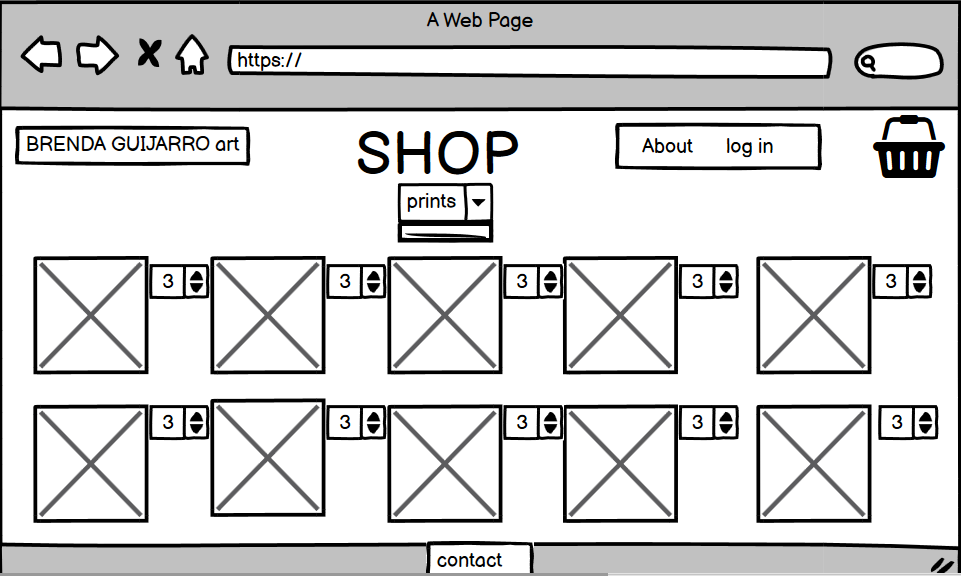
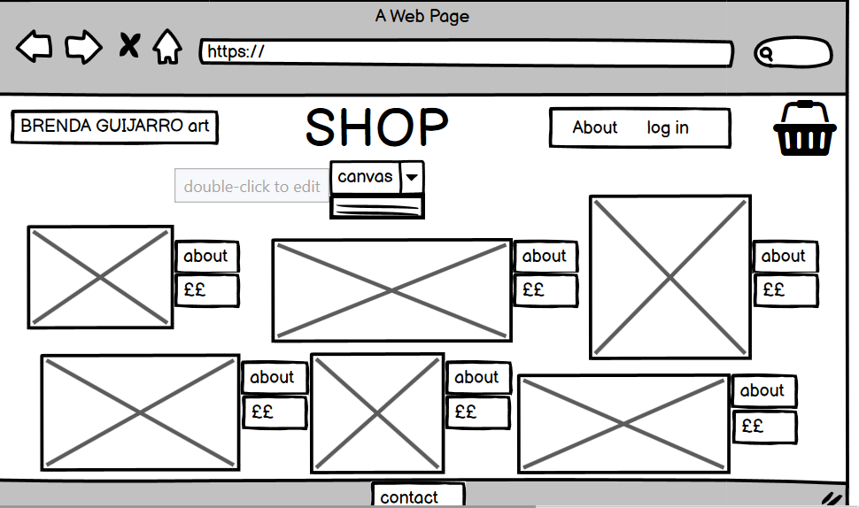
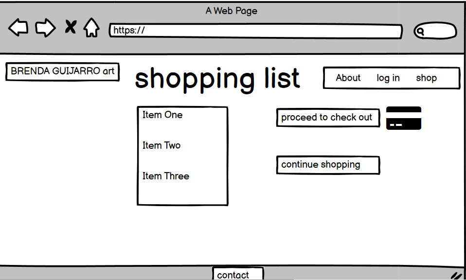

# Brenda Guijarro Tinoco #
## Art E-commerce ## 

## UX ##

Project Goals:
 * Create an interactive , attractive and responsive art online shop
 * Create a functional e-commerce for an Oil paintings artist.
 * Create an environment where clients can create a space for sharing info about Art.
 
 
### Design Process ###

Provide a powerfull e-commerce for an artist which will assist to  attract more clients, possible commisions and 
open up to the professional artistic world.
To sketch the frontend part of the project I have used Blasamiq wireframes:

  
   
## General Features ##

The site counts with three different product pages: Canvas, prints, and All products which combines both. 
On all three pages, you can sort the products by price from low to high.
The Prints have the option to choose size because they all can be made in A5, A4, and A3. 
In the future I will add a fourth product page will it contain a large variety of accessories and possibly some clothing.
It also counts with a shopping bag and checkout functionality. 
If a client desires to sign up to track its orders through BGT art shop exists the possibility to register and save your payment, shipping details, and no less important order history.
However, is not required to be registered to place orders or turn into Brenda's art lover. 
The layout of the product pages is been designed using Bootstrap card elements and helped me a lot to create this 'art gallery' vibe that fits the most for this site. 
The carousel also makes an impression and visibly impacts the user,
advertising past commissions or expositions.
Also, users can use the page "Art Community" as a space for sharing interesting info about , exhibitions, posible collaborations and so on.

## SuperUser Features ##
All superusers have access to the CRUD functionality (Only site Admins):

1. C - Create: Allowed to add products and access to the db.
2. R - Read: Full access to all products.
3. U - Uptade: Update or change products and posts.
4. D - Delete: Delete products posts.

Technologies Used:
 1. HTML5 : Used to create the form and the content of the web site.
 2.	CSS3 : Used to style the HTML
 3. Bootstrap Frameworks: Used some components, Header and card layout and Caroussel. 
    Also used the grid system to make the website responsive for all size devices.
 4. JavaScript: For interactivity.
 5. JQuery : The project uses JQuery to simplify DOM manipulation.
 4. Gitpod and Github : to write , test and deploy my code. 
 5. Heroku : to Deploy my project and store sensible data variables.
 6. Python3, Flask and Json
 7. Django
 8. AWS (Amazon Web Services)
 9. Stripe : to handle payments and webhooks
 10. SQLite3 and Postgres
 11. Installed few liabraries :
    - asgiref==3.3.4
    - boto3==1.17.91
    - botocore==1.20.91
    - d- j-database-url==0.5.0
    - Django==3.2.3
    - django-allauth==0.41.0
    - django-countries==7.2.1
    - django-crispy-forms==1.11.2
    - django-storages==1.11.1
    - gunicorn==20.1.0
    - jmespath==0.10.0
    - oauthlib==3.1.0
    - Pillow==8.2.0
    - psycopg2-binary==2.8.6
    - python3-openid==3.2.0
    - pytz==2021.1
    - requests-oauthlib==1.3.0
    - s3transfer==0.4.2
    - sqlparse==0.4.1
    - stripe==2.57.0

Features to implement :

I wanted to add an accessories page 

## Testing ##

I have Validated the code using: 
 * HTML   [HTML-Validator](https://validator.w3.org/#validate_by_input) - No errors found.
 * CSS    [CSS-Validator](https://jigsaw.w3.org/css-validator/#validate_by_input) - No errors found.
 * JS     [JS -Validator](https://jshint.com/) - No errors found.
 * Python [Python-Validator](http://pep8online.com/checkresult) - No errors found.

Tested the website in different browsers:    
* Chrome
* Edge
* Mozilla Firefox 
* Safary
    
I have also used the Inspect tool from Google Chrome to testt the responsiveness of the website in different size devices and 
manually tested in iPhone 6, 7 Plus, 8, xs, 12 pro, MacBook Pro 15", Asus VivoBook 14.5", HP Envy 21" , Ipad 3 and Ipad Pro 5.

* Navbar from medium and small devices converts into a dropdown menu. 
* The card containers from Bootstrap that have been used to organize the layout of the products pages;
  from medium to small  screen sizes, the number of columns used per card is larger in a way it only shows one card at
  a time. Same with the input forms for editing and uploading items, and carousel and collapsible for the Home page.

## Deployment ## 

This project was entirely built in Gitpod and deployed in Heroku and GitHub. 

Deployment steps:

Create a new Heroku app:

1. Open Heroku  [Heroku](https://id.heroku.com/login) and sign up if you don't have an account already.

2. Once you are logged or signed in, on the drop-down menu button called "New" that is on the top right corner select the option "Create a new app"

3. Once "Create a new app is been selected, gives you the option to name the app, in this case, brendas-shop and choose the region or country nearest to your location and confirm these changes by clicking again on "Create new app".

Connect Heroku app to Github repository

4. Once the app is been created, the next thing to do is connect it to the Github repository by selecting the option "Deploy" on the menu and also select the option Github - Connect to Github

5. Search for your Github repository name right below where you have chosen 
to connect the Heroku app to Github and once you found your repository name,
select it and confirm it by clicking on the "Connect" button. 

Setup PostgresSQL Database

6. On the same menu, you found the "Deploy" option for your Heroku app you can also find "Resources" and go to "Add-ons". 

7. Search for Heroku Postgres.

8. Select the plan named "Hobby Dev - Free" and then click "Submit order form".

Set environment variables

9. Click on  "Settings" at the menu and select the option "Reveal config vars"

10. Add the following variables : (Please be aware that the value of the following keys are secret and for private use and cannot be shared to ensure the security of the project.)

- AWS_ACCESS_KEY_ID

- AWS_SECRET_ACCESS_KEY

- DATABASE_URL

- EMAIL_HOST_PASS

- EMAIL_HOST_USER

- SECRET_KEY

- STRIPE_PUBLIC_KEY

- STRIPE_SECRET_KEY

- STRIPE_WH_SECRET

- USE_AWS

Enable automatic deployment

11. Return to the menu option "Deploy" and look for  "Automatic Deployment"

12. At last, select the branch we are deploying and confirm on "Enable Automatic Deploys"

1. Open GitHub  [GitHub](https://github.com/).
2. Select desired repository on the menu, option "Repositories".
3. Click on clone or download.
4. Start your IDE and:
  
   * open a terminal window in the directory you choose and type in the "git clone" command followed by the copied URL or for zip file
   * open the downloaded files from your IDE and install the required packages for the projects by entering the following command in the shell: pip install -r requirements.txt.

5. Fork workspace on Gitpod or in your IDE so you can prevent your workspace from disappearing  after 15 days unused and restarting the process again to run the project locally.
6. In the end, you will need to add the required environment variables for the correct setup of your project. If doing this in Gitpod  the steps are the following:
- Go to settings on the top menu.
- Variables.
- Select button "New variable"
- Add the name, value, and scope.
- confirm this by clicking on "Add Variable".

You can see the website [GitHub](https://SaraSanchezz.github.io/4MilestoneProject/)
                        [Heroku](https://brendas-shop.herokuapp.com/)

## Credits ## 

### Content ###
- The content of the page is been written by me and at the projects page is been copied from the projects structure and requirements, from the module materials.
- There are some parts of the code taken from Bootstrap componenents and after have been adjusted and modified it 
 to my web needs as for example:
    - [Navbar](https://materializecss.com/navbar.html)
    - [Collapsible](https://materializecss.com/collapsible.html)
    - [Carousel](https://materializecss.com/carousel.html)
    - [Card-structure](https://materializecss.com/cards.html)
    - [Footer](https://materializecss.com/footer.html)

### Media ### 
- All paintings are made by Brenda Guijarro Tinoco, who had let me used her beautiful art to create this project.
- Carousel images have been done online: [placeit.com](https://placeit.net/). 

### Acknowledgements ### 

- [W3Schools.com](https://www.w3schools.com/).
- [MDB](https://mdbootstrap.com/).
- [Materialize](https://materializecss.com/about.html)
- [Stackoverflow](https://stackoverflow.com/).
- Slack Community. 
- All the tutors who had assisted me during the process, the were all helpful and extremelly kind.
